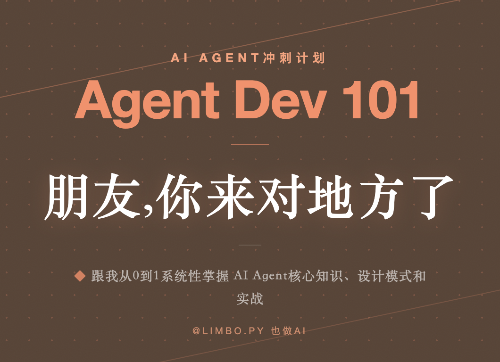

# Agent Dev 101

两个月系统化学习 AI Agent 开发，从 LLM 基础到生产级多 Agent 系统。

**每日投入**: 2–3 小时 · **总天数**: 56 天

---

## 学习计划

完整计划 → [blog/learning-plan.md](./blog/learning-plan.md)

| 周次 | 主题 | 核心交付物 |
| :---: | ------ | ---------- |
| Week 1 | LLM 核心概念 | 多轮对话 CLI + Context Engineering 笔记 |
| Week 2 | Function Calling + ReAct + 结构化输出 | 从零实现 ReAct Agent + CLI 助手 |
| Week 3 | LangChain 基础 + RAG | LangChain Agent + RAG 文档问答系统 |
| Week 4 | LangChain 进阶 + LangGraph | LangGraph Agentic RAG 系统 |
| Week 5 | 多 Agent 系统 + MCP 协议 | 多 Agent 协作系统 + MCP Server |
| Week 6 | Harness Engineering + 框架探索 | Harness 改进报告 + 新框架复现 |
| Week 7 | 评估、安全与部署 | 可部署的 Agent API 服务 |
| Week 8 | 总结与最佳实践 | AI Agent 开发最佳实践与踩坑指南 |

---

## 学习笔记

| 编号 | 笔记 |
| :---: | ------ |
| W1-D1-01 | [Token 和 Embedding 基础知识](./blog/W1-D1-01%20token%20和%20embedding%20基础知识.md) |
| W1-D1-02 | [Embedding 概念与实战](./blog/W1-D1-02%20Embedding%20概念与实战.md) |
| W1-D1-03 | [Chat Templates 与角色系统](./blog/W1-D1-03%20Chat%20Templates%20与角色系统.md) |
| W1-D2-01 | [LLM 模型参数避坑指南](./blog/W1-D2-01%20LLM%20模型参数避坑指南：Agent%20开发者最该知道的事.md) |
| W1-D2-02 | [API 调用实战：用 Python SDK 完成第一次多轮对话](./blog/W1-D2-02%20API%20调用实战：用%20Python%20SDK%20完成你的第一次多轮对话.md) |
| W1-D2-03 | [多轮对话与消息管理](./blog/W1-D2-03%20多轮对话与消息管理：Token%20计数、截断策略和对话历史的正确打开方式.md) |
| W1-D3-01 | [Prompt Engineering 回顾](./blog/W1-D3-01%20Prompt%20Engineering%20回顾：从会写提示词到理解"信息设计".md) |
| W1-D3-02 | [什么是 Context Engineering](./blog/W1-D3-02%20什么是%20Context%20Engineering：从"写好提示词"到"设计信息系统".md) |
| W1-D4-01 | [Context Engineering 核心模式与实践](./blog/W1-D4-01%20Context%20Engineering%20核心模式与实践：从理论到落地.md) |
| W1-D4-02 | [Prompt Cache 全解析](./blog/W1-D4-02%20Prompt%20Cache%20全解析：原理、厂商对比与最佳实践.md) |

---

## 快速导航

- **学习计划**: [blog/learning-plan.md](./blog/learning-plan.md)
- **所有笔记**: [blog/](./blog/)
- **代码实践**: [days/](./days/)
